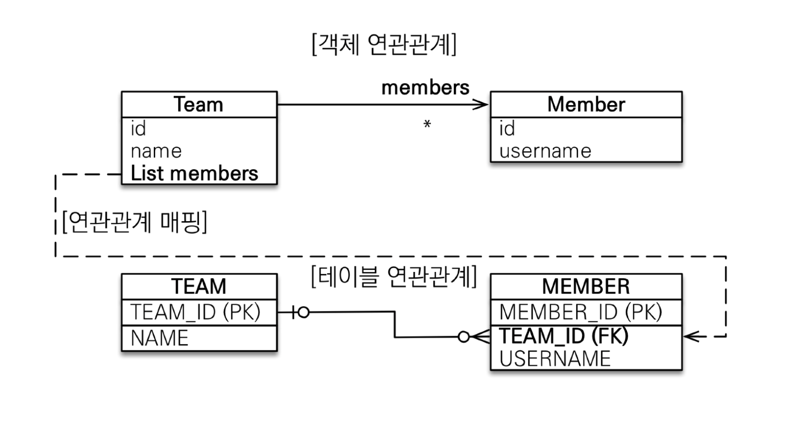

## 다중성

- 다대일: @ManyToOne
- 일대다: @OneToMany
- 일대일: @OneToOne
- 다대다: @ManyToMany

JPA 의 어노테이션은 대부분 DB와 매핑하기 위해 존재<br>
그렇기 때문에 데이터베이스 기준으로 생각하면 됨 <br>
다대다는 실무에서 쓰이지 않음.

<br>

### 다대일(N:1) 단방향

- 가장 많이 사용하는 연관관계
- 다대일의 반대는 일대다
- 다쪽에 외래키

<br>

### 다대일(N:1) 양방향

- 외래키 있는 쪽이 연관관계 주인
- 양쪽을 서로 참조

<br>

### 일대다(1:N) 단방향

실무에서 거의 없음..<br>

팀은 멤버를 알아야하는데 멤버는 팀에 관심 없는 경우<br>
그런데 DB 상에는 무조건 다쪽에 FK가 있어야함<br>



```java
// Team.java

@OneToMany
@JoinColumn(name = "TEAM_ID")
private List<Member> members = new ArrayList<>();
```

```java
Member member = new Member();
member.setName("member1");

entityManager.persist(member);

Team team = new Team();
team.setName("teamA");
// member table update 필요
team.getMembers().add(member);

entityManager.persist(team);
```

실행 시 다음과 같이 update 쿼리가 수행된다.

```sql
Hibernate: 
    /* create one-to-many row org.example.entity.Team.members */ update
        Member 
    set
        TEAM_ID=? 
    where
        MEMBER_ID=?
```

- 객체와 테이블의 차이 때문에 반대편 테이블의 외래 키를 관리하는 특이한 구조<br>
- 코드 상 팀에만 손을 댄 것 같은데 member table update가 되어서 테이블 수십개가 엮여있는 상황이라면 운영 시 어려움 <br>
    - 이럴 때는 양방향으로 member에서 관리 (member 에서 team 으로 갈 일이 없더라도 trade off) <br>
- @JoinColumn 을 꼭 사용해야함. 그렇지 않으면 조인 테이블 방식 사용함
    - 중간에 테이블이 하나 추가됨 (TEAM_MEMBER)
- 일대다 단방향 매핑보다는 다대일 양방향 매핑을 사용하자