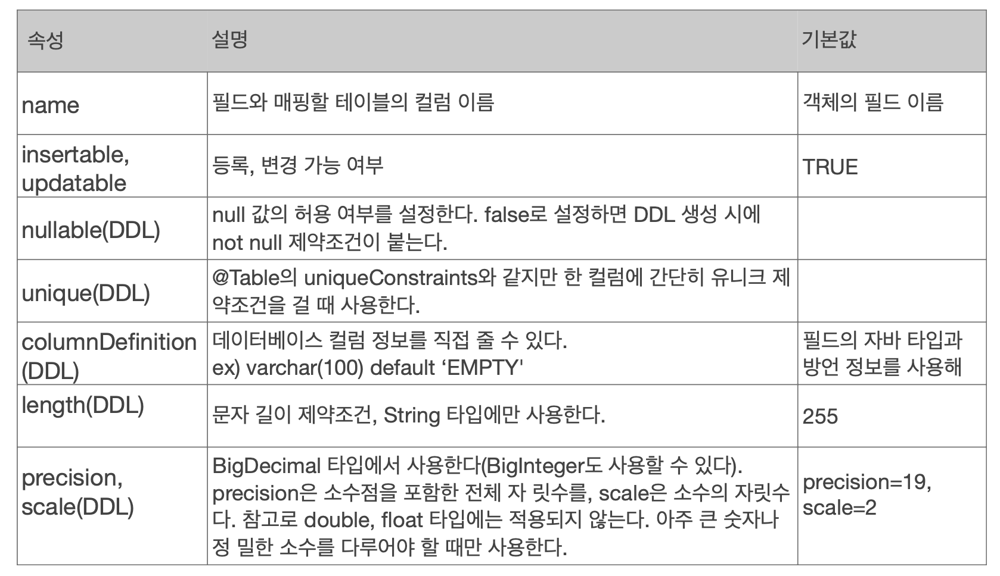

# 엔티티 매핑

## 객체와 테이블 매핑

 

### @Entity

- @Entity 가 붙은 클래스는 JPA가 관리, 엔티티라 한다.
- 기본 생성자 필수
- final, enum, interface, inner class 사용 X
- 데이터베이스에 저장할 필드에 final 사용 X

 

### @Column

- nullable = false 면, not null 제약조건
- unique 는 이름이 랜덤으로 생성되어서 잘 안씀, @Table 에서 거는 방식 선호

 

### @Enumerated

- EnumType.ORDINAL: enum 순서를 데이터베이스에 저장 (0, 1, 2 ...)
- EnumType.STRING: enum 이름을 데이터베이스에 저장. default: EnumType.ORDINAL

-> EnumType.ORDINAL 사용하지 않도록 주의, enum 의 순서는 언제든 바뀔 수 있다.

 

### @Temporal

- 지금은 필요없음
- java.util.Date, java.util.Calendar 매핑 시 사용
- LocalDate(년,월), LocalDateTime(년,월,일) 사용할 때는 생략 가능

 

### 기본 키 매핑

- 직접 할당: @Id
- 자동 생성: @GeneratedValue
    - IDENTITY: 데이터베이스에 위임, e.g. MYSQL AUTO_INCREMENT
        - 데이터베이스에 INSERT SQL 을 실행한 후에 ID 값을 알 수 있음
        - em.persist() 시점에 즉시 INSERT SQL 실행하고 DB 에서 식별자 조회
        - 1차 캐시, 영속성 컨텍스트 안에 @Id 값이 있어야해서...
    - SEQUENCE: 데이터베이스 시퀀스 오브젝트 사용, ORACLE
        - @SequenceGenerator 필요
    - TABLE: 키 생성용 테이블 사용, 모든 DB
        - @TableGenerator 필요
    - AUTO: 위 셋중에 하나, 방언에 따라 자동 지정, 기본값

 

### 권장하는 식별자 전략

- 기본키 제약 조건: null 아님, 유일, 변하면 안된다!(먼 미래까지)
- 미래까지 이 조건을 만족하는 자연키(주민등록번호 등)는 찾기 어렵다. 대리키(대체키, 비즈니스와 상관 없는 번호)를 사용하자.
- <strong> 권장: Long 형(10억 넘어도 동작해야하니까) + 대체키 + 키 생성전략 사용 </strong>

