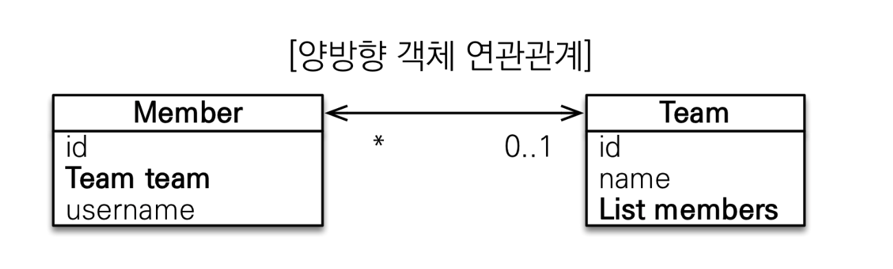
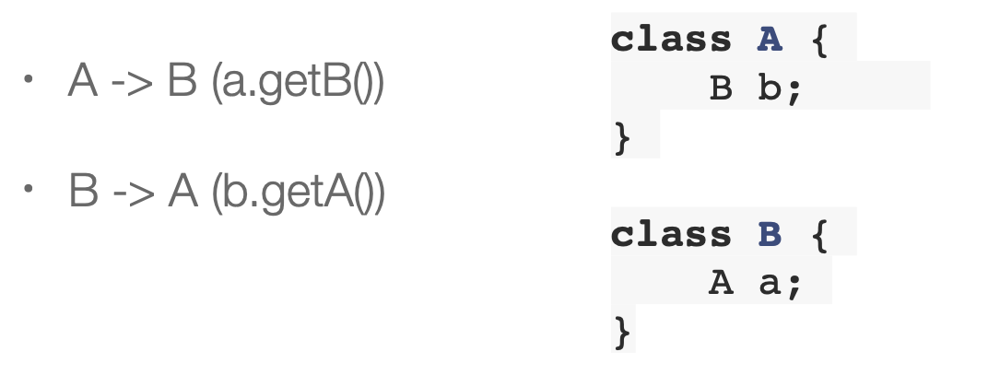

# 연관관계 매핑 기초

## 단방향 연관관계

객체를 테이블에 맞추어 데이터 중심으로 모델링하면, 협력 관계를 만들 수 없다.

- 테이블은 외래 키로 조인을 사용해서 연관된 테이블을 찾는다.
- 객체는 참조를 사용해서 연관된 객체를 찾는다.

-> 테이블과 객체 사이의 간극이 존재<br>
-> 객체지향적인 모델링이란 객체 안에 FK가 아닌, 참조할 객체가 설정되어있어야함

<br>

``` java
@Entity
@Getter
@Setter
@NoArgsConstructor
public class Member {
    @Id
    @GeneratedValue
    @Column(name = "MEMBER_ID")
    private Long id;

    @Column(name = "USERNAME")
    private String username;

    @ManyToOne // 관계가 뭔지
    @JoinColumn(name = "TEAM_ID") // Join 하는 컬럼
    private Team team;
}


@Entity
@Getter
@Setter
public class Team {
    @Id
    @GeneratedValue
    @Column(name = "TEAM_ID")
    private Long id;

    private String name;
}
```

```java
public class JpaMain {
    public static void main(String[] args) {
        EntityManagerFactory emf = Persistence.createEntityManagerFactory("hello");

        EntityManager entityManager = emf.createEntityManager();

        EntityTransaction tx = entityManager.getTransaction();
        tx.begin();

        try {
            Team team = new Team();
            team.setName("TeamA");
            entityManager.persist(team);

            Member member = new Member();
            member.setUsername("Member1");
            member.setTeam(team);
            entityManager.persist(member);

            Member findMember = entityManager.find(Member.class, member.getId());

            Team findTeam = findMember.getTeam();
            System.out.println("findTeam = " + findTeam.getName());

            tx.commit();
        } catch (Exception e) {
            e.printStackTrace();
            tx.rollback();
        } finally {
            entityManager.close();
        }
        emf.close();
    }
}
```

<br>

## 양방향 연관관계와 연관관계의 주인

객체는 참조, 테이블은 FK 로 연관관계를 찾는다는 차이를 이해해야함 <br>
<br>
<strong>양방향 매핑이란?</strong> <br>
멤버와 팀의 관계에서, 멤버를 찾아서 팀을 찾을 수도 있지만 팀으로 멤버를 찾을 수도 있는 것<br>

<br>
<strong>테이블 연관관계</strong> <br>
멤버에서 내가 소속된 팀을 알고싶다면, TEAM_ID(FK) 로 조인하여 검색 <br>
FK 하나로 서로의 연관을 다 알 수 있는 것이다.
<br><br>
<strong>양방향 객체 연관관계</strong> <br>
기존에는 팀에서 멤버로 갈 수 있는 방법이 없었다. <br>
그래서 List members 를 넣어주게 됨

<br>



```java
@OneToMany(mappedBy = "team") // 일대다 매핑에서 반대편 사이드(member)에서 뭐랑 연결되어있는지
private List<Member> members = new ArrayList<>(); // NPE 방지 위해 관례로 초기화
```

```java
// 반대방향으로 객체 탐색 가능
Member findMember = entityManager.find(Member.class, member1.getId());
List<Member> memberList = findMember.getTeam().getMembers();
```

<br>

### 연관관계의 주인과 mappedBy

<strong>객체와 테이블이 관계를 맺는 차이</strong>

- 객체 연관관계 = 단방향 연관 관계 2개

    - 회원 -> 팀
    - 팀 -> 회원

- 테이블 연관관계 = 1개

    - 회원 <-> 팀의 연관관계 1개(양방향 또는 방향이 없음)
        - FK 하나로 두 테이블의 연관 관계를 관리


<br>
<strong>객체의 양방향 관계</strong>

- 객체의 양방향 관계는 서로 다른 단방향 관계 2개다.
- 객체를 양방향으로 참조하려면 (참조 값을 넣어놓아야하는)단방향 연관관계 2개를 만들어야한다.




<br>

### 연관 관계의 주인 (Owner)

참조가 양쪽에 있기 때문에 어느쪽이 업데이트 될때 테이블을 업데이트 해야하나? <br>
-> mappedBy 로 설정

<br>
<strong>양방향 매핑 규칙</strong>

- 객체의 두 관계 중 하나를 연관관계의 주인으로 지정
- 연관관계의 주인만이 FK 관리(등록, 수정)
- 주인이 아닌 쪽은 읽기만 가능
- 주인은 mappedBy 속성 사용 X
- 주인이 아니면 mappedBy 속성으로 주인 지정

<br>

```java
// 역방향(주인이 아닌 방향)만 연관관계 설정
// 연관관계의 주인에 값을 입력하지 않으면 업데이트되지 않음
team.getMembers().add(member);

// 올바른 방법
// 연관관계의 주인에 값 설정
// N:1에서 'N' 쪽이 주인이어야함
member.setTeam(team);
```