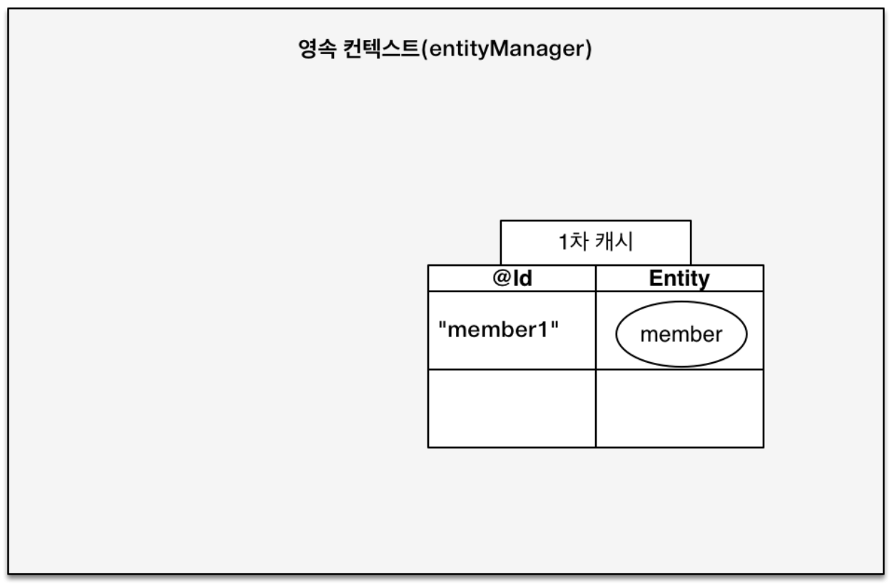
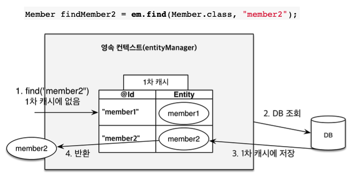
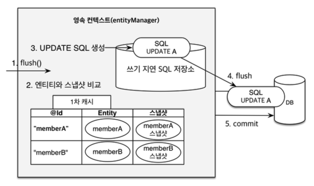

# 영속성 컨텍스트

## JPA 에서 가장 중요한 2가지

- 객체와 관계형 데이터베이스 매핑하기
- 영속성 컨텍스트 (JPA 내부에서 어떻게 동작해?)

<br>

## 영속성 컨텍스트

- 엔티티를 영구 저장하는 환경
- 논리적인 개념, 눈에 보이지 않는다.
- 엔티티 매니저를 통해서 영속성 컨텍스트에 접근

<br>

## 엔티티의 생명주기

- 비영속 (new/transient): 영속성 컨텍스트와 전혀 관계 없는 새로운 상태

- 영속 (managed): 영속성 컨텍스트에 관리되는 상태

- 준영속 (detached): 영속성 컨텍스트에 저장되었다가 분리된 상태

- 삭제 (removed): 삭제된 상태

```java
// 비영속
Member member = new Member();
member.setId(1L);
member.setName("Yuna");

// 영속
entityManager.persist(member);

// 준영속
entityManager.detach(member);

// 삭제
entityManager.remove(member);
```

<br>

## 영속성 컨텍스트의 이점

- 1차 캐시
- 동일성 (identity) 보장
- 트랜잭션을 지원하는 쓰기 지연 (transactional write-behind)
- 변경 감지 (Dirty Checking)
- 지연 로딩 (Lazy Loading)

<br>

## 엔티티 조회, 1차 캐시



```java
// 1차 캐시에 저장됨
em.persist(member);

// 1차 캐시에서 조회
Member findMember = em.find(Member.class, "member1");
```

DB 에서 찾기 전에 1차 캐시에서 조회

<br>

## 데이터 베이스에서 조회

영속 컨텍스트 안에 있는 1차 캐시에 member2 가 없네? <br>
다음과 같이 진행된다.



엔티티 매니저는 데이터베이스 트랜잭션 단위로 만들기 때문에 <br>
고객의 요청이 하나 들어와서 비즈니스가 끝나버리면, 영속성 컨텍스트를 지운다. <br>
1차 캐시가 다 삭제되는 것. <br>
따라서 굉장히 짧은 시간에 사용되기 때문에 큰 성능 이점은 아님.

<br>

## 영속 엔티티의 동일성 보장

```java
Member a = em.find(Member.class, "member1");
Member b = em.find(Member.class, "member1");
System.out.println(a == b); //동일성 비교 true
```

1차 캐시로 반복 가능한 읽기(REPEATABLE READ) 등급의 트랜잭션 격리 수준을 데이터베이스가 아닌 애플리케이션 차원에서 제공

<br>

## 엔티티 등록
### 트랜잭션을 지원하는 쓰기 지연

```java
EntityManager em = emf.createEntityManager();
EntityTransaction transaction = em.getTransaction();

//엔티티 매니저는 데이터 변경시 트랜잭션을 시작해야 한다.
transaction.begin();

em.persist(memberA);
em.persist(memberB);
//여기까지 INSERT SQL을 데이터베이스에 보내지 않는다.

//커밋하는 순간 데이터베이스에 INSERT SQL을 보낸다.
transaction.commit();
```
 
<br>
em.persist(memberA); 에서 벌어지는 일

- 1차 캐시 저장
- INSERT 쿼리 생성하여 쓰기 지연 SQL 저장소에 저장

em.persist(memberB); 에서 벌어지는 일

- 1차 캐시 저장
- INSERT 쿼리 생성하여 쓰기 지연 SQL 저장소에 저장

--> A,B 두 개 쌓인 상태
--> transaction.commit() 시에 동시에 flush

<br>

## 엔티티 수정
### 변경 감지 (Dirty Checking)

JPA의 목적은 자바 컬렉션처럼 데이터를 꺼내 쓰는 것 <br>

```java
// 영속 엔티티 조회
Member member = em.find(Member.class, 150L);
// 영속 엔티티 데이터 수정
member.setName("TEST");

//em.persist(member) 이런 코드가 없어도 됨
```

실행해보면 SELECT, UPDATE 쿼리 수행 됨! <br>
자바 컬렉션을 다루듯이 set 만으로 업데이트 가능 <br>



캐시 안에는 엔티티뿐 아니라 스냅샷이 있음 <br>
값을 가져온 최초 시점에 떠진 스냅샷<br>
JPA 가 트랜잭션이 커밋되는 시점에 flush()가 호출되면서 스냅샷과 비교함 <br>


<br>

## 플러시

영속성 컨텍스트의 변경 내용을 데이터베이스에 반영<br>

### 플러시 발생

- 변경 감지
- 수정된 엔티티 쓰기 지연 SQL 저장소에 등록
- 쓰기 지연 SQL 저장소의 쿼리를 데이터베이스에 전송(등록, 수정, 삭제 쿼리)

-> 커밋되는 것은 아님 <br>
-> 1차 캐시는 유지, 데이터베이스에 반영되는 것

<br>

### 영속성 컨텍스트를 플러시하는 방법

- em.flush(): 직접 호출
- 트랜잭션 커밋: 플러시 자동 호출
- JPQL 쿼리 실행: 플러시 자동 호출

<br>

### 플러시 정리

- 영속성 컨텍스트를 비우지 않음
- 영속성 컨텍스트의 변경 내용을 데이터베이스에 동기화
- 트랜잭션이라는 작업 단위가 중요 -> 커밋 직전에만 동기화하면 되기 때문에

<br>

## 준영속 상태

- 영속(1차 캐시 올라간 상태) -> 준영속
- 영속 상태의 엔티티가 영속성 컨텍스트에서 분리 (detached)
- 더티체킹 같은 영속성 컨텍스트가 제공하는 기능을 사용 못함

-> 직접 쓸 일은 거의 없음

<br>

### 준영속 상태로 만드는 방법

- em.detach(entity): 특정 엔티티만
- em.clear(): 영속성 컨텍스트 초기화 (1차 캐시 클리어, TC 작성 시 도움)
- em.close(): 영속성 컨텍스트 종료

<br>
