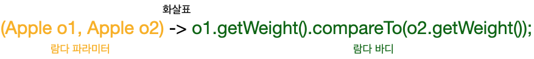

<br>

## <strong>람다란 무엇인가?</strong>

<br>
<br>
람다 표현식은 메서드로 전달할 수 있는 익명 함수를 단순화한 것이라고 할 수 있다.<br>
람다 표현식에는 이름은 없지만, 파라미터 리스트, 바디, 리턴 타입, 발생할 수 있는 예외 리스트를 가질 수 있다.
<br>
<br>
람다의 특징을 하나씩 살펴보자.<br><br>

- <strong>익명</strong>

    보통의 메서드와 달리 이름이 없으므로 익명이라고 표현한다. 구현해야 할 코드가 적어진다.


- <strong>함수</strong>

    람다는 메서드처럼 특정 클래스에 종속되지 않으므로 함수라고 부른다.<br>
    하지만 메서드처럼 파라미터 리스트, 바디, 리턴 타입, 가능한 예외 리스트를 포함한다.


- <strong>전달</strong>

    람다 표현식을 메서드 인수로 전달하거나 변수로 저장할 수 있다.


- <strong>간결성</strong>

    익명 클래스처럼 자질구레한 코드를 구현할 필요가 없다.
<br>
<br>
<br>

<strong>람다</strong>를 이용하면 간결한 방식으로 코드를 전달할 수 있다.<br>
예를 들어 커스텀 Comparator 객체를 보자.<br>
<br>

```java
Comparator<Apple> byWeight = new Comparator<Apple>() {
    @Override
    public int compare(Apple o1, Apple o2) {
        return o1.getWeight().compareTo(o2.getWeight());
    }
};
```

<br>
람다를 이용하면 다음과 같이 간소화할 수 있다.<br>

```java
Comparator<Apple> byWeight2 = 
                (Apple o1, Apple o2) -> o1.getWeight().compareTo(o2.getWeight());
```

<br>
<br>
그렇다면 람다를 어디에서 어떻게 사용할 수 있는지 알아보자.
<br><br>


<br>

- 파라미터 리스트<br>
Comparator 의 compare 메서드 파라미터(사과 두 개)<br>

- 화살표<br>
화살표(->)는 람다의 파라미터 리스트와 바디를 구분한다.<br>

- 람다 바디<br>
두 사과의 무게를 비교한다. 람다의 반환값에 해당하는 표현식이다.<br>

<br>
<br>

다음은 자바8에서 지원하는 다섯 가지 람다 표현식 예제를 보자. <br><br>

```java
(String s) -> s.length()
```
String 형식의 파라미터 하나를 가지며 int 를 리턴한다.<br>
람다 표현식에는 return 이 함축되어 있으므로 return 문을 명시적으로 사용하지 않아도 된다.<br>

<br>

```java
(Apple a) -> a.getWeight() > 150
```
Apple 형식의 파라미터 하나를 가지며 boolean(사과가 150그램보다 무거운지 결정)을 리턴한다.<br>

<br>

```java
(int x, int y) -> {
    System.out.println("Result:");
    System.out.println(x+y);
}
```
int 형식의 파라미터 두 개를 가지며 리턴값이 없다.(void 리턴)<br>
이 예제에서 볼 수 있듯이 람다 표현식은 여러 행의 문장을 포함할 수 있다.<br>

<br>

```java
() -> 42
```
파라미터가 없으며 int 42 를 리턴한다. <br>

<br>

```java
(Apple a1, Apple a2) -> a1.getWeight().compareTo(a2.getWeight()
```
Apple 형식의 파라미터 두개를 가지며 int(두 사과의 무게 비교 결과)를 리턴한다.<br>

<br>
<br>

다음은 람다 규칙에 맞지 않는 예제를 보자.

<br>

```java
(Integer i) -> return "Yuna" + i; // (X)
(Integer i) -> {return "Yuna" + i;} // (O)
```

<br>

```java
(String s) -> {"Iron Man";} // (X)
(String s) -> "Iron Man"; // (O)
```

다음과 같이 사용할 수 있다. <br>

```java
interface StringInterface {
    String strMethod(String s);
}
```

```java
StringInterface str = (String s) -> "Iron Man";
```

<br>
<br>
다음은 몇 가지 람다 사용 사례를 보자. <br><br>

- 불리언 표현식

```java
(List<String> list) -> list.isEmpty()
```

<br> 

- 객체 생성

```java
() -> new Apple(10)
```

<br> 

- 객체에서 소비

```java
(Apple a) -> {
    System.out.println(a.getWeight());
}
```

<br> 

- 객체에서 선택/추출

```java
(String s) -> s.length()
```

<br> 

- 두 값을 조합

```java
(int a, int b) -> a * b
```

<br>

- 두 값을 비교

```java
(Apple a1, Apple a2) -> a1.getWeight().compareTo(a2.getWeight())
```

<br>
