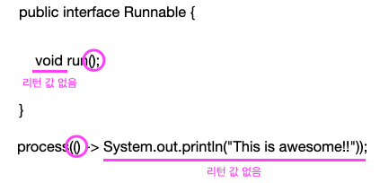

<br>

## <strong>어디에, 어떻게 람다를 사용할까?</strong>

<br>

이전 예제에서는 Comparator<Apple> 형식의 변수에 람다를 할당했다.<br>
2장에서 구현했던 필터 메서드에도 람다를 활용할 수 있었다.<br>

```java
List<Apple> res = 
    filter(inventory, (Apple apple) -> Apple.Color.GREEN.equals(apple.getColor()));
```

<br>
이처럼 함수형 인터페이스라는 문맥에서 람다 표현식을 사용할 수 있다. <br>
위 에제에서는 함수형 인터페이스 Predicate<T> 를 기대하는 filter 메서드의 두 번째 인수로 람다 표현식을 전달했다.<br> 그렇다면 함수형 인터페이스가 무엇인지 알아보자.<br>

<br><br>

### <strong>함수형 인터페이스</strong>

2장에서 만든 Predicate<T> 인터페이스로 필터 메서드를 파라미터화할 수 있었다.<br>
여기서 바로 Predicate<T> 가 함수형 인터페이스다.<br> Predicate<T> 는 오직 하나의 추상 메서드만 지정하기 때문이다.


```java
public interface Predicate<T> {
    boolean test T (T t);
}
```

<u>함수형 인터페이스</u>는 정확히 하나의 추상 메서드를 지정하는 인터페이스이다.<br>
자바 API의 함수형 인터페이스로 Comparator, Runnable 등이 있다. <br>

```java
public interface Comparator<T> {
    int compare(T o1, T o2);
}

public interface Runnable {
    void run();
}

public interface Callable<V> {
    V call() throws Exception;
}
```

(참고) 많은 디폴트 메서드가 있더라도 추상 메서드가 오직 하나면 함수형 인터페이스다.
<br>디폴트 메서드: 인터페이스의 메서드를 구현하지 않은 클래스를 고려해서 기본 구현을 제공하는 바디를 포함하는 메서드
<br>
<br>

다음 중 함수형 인터페이스는 어느 것일까?<br>
```java
public interface Adder {
    int add(int a, int b);
}

public interface SmartAdder extends Adder {
    int add(double a, double b);
}

public interface Nothing {

}
```

답은 Adder 만 함수형 인터페이스이다. <br>
SmartAdder 는 두 추상 add 메서드(하나는 Adder에서 상속받음)를 포함하므로 함수형 인터페이스가 아니다.<br>
Nothing 은 추상 메서드가 없으므로 함수형 인터페이스가 아니다. <br>
<br>
람다 표현식으로 함수형 인터페이스의 추상 메서드 구현을 직접 전달할 수 있으므로 <br>
<strong>전체 표현식을 함수형 인터페이스의 인스턴스로 취급</strong>(함수형 인터페이스를 구현한 클래스의 인스턴스)할 수 있다.

<br>
이러한 기능은 익명 내부 클래스로도 구현이 가능하다.<br>
Runnable 을 사용한 다음 예제로 두 방식을 비교해보자. <br>

```java
public static void main(String[] args) {
    Runnable r1 = () -> System.out.println("Hello world 1"); // 람다 사용

    Runnable r2 = new Runnable() { // 익명 클래스 사용
        @Override
        public void run() {
            System.out.println("Hello world 2");
        }
    };

    process(r1); // 'Hello World 1' 출력
    process(r2); // 'Hello World 2' 출력
    process(() -> System.out.println("Hello World 3")); // 'Hello World 3' 출력 
}

public static void process(Runnable r) {
    r.run();
}
```

<br><br>

### <strong>함수 디스크립터</strong>
함수형 인터페이스의 추상 메서드 시그니처는 람다 표현식의 시그니처를 가리킨다.<br>
시그니처란 메서드의 이름과 파라미터를 뜻한다. 그리고 람다 표현식의 시그니처를 서술하는 메서드를 <strong>함수 디스크립터</strong> 라고 부른다.

함수 디스크립터에 관해서는 이후에 자세히 설명하고, 이 장에서는 람다와 함수형 인터페이스에서 사용하는 표기법에 대해 알아본다. <br><br>

```java
() -> void
```

이 표기는 파라미터 리스트가 없으며 void 를 리턴하는 함수를 의미한다. <br>
즉, 앞서 알아 본 Runnable 과 같은 함수가 이에 해당한다. <br><br>

```java
(Apple, Apple) -> int
```

는 두 개의 Apple 을 인수로 받아 int 를 리턴하는 함수를 가리킨다.<br>
이처럼 람다 표현식은 변수에 할당하거나 함수형 인터페이스를 인수로 받는 메서드로 전달할 수 있으며, 함수형 인터페이스의 추상 메서드와 같은 시그니처를 갖는다.<br><br> 예를 들어 이전 예제에서는 다음처럼 process 메서드에 직접 람다 표현식을 전달했다. <br>

```java
public void process(Runnable r) {
    r.run();
}

process(() -> System.out.println("This is awesome!!"));
```

위 코드를 실행하면 'This is awesome!!' 이 출력된다.<br> () -> System.out.println("This is awesome!!") 은 인수가 없으며 void 를 리턴하는 람다 표현식이다.<br> 이는 Runnable 인터페이스의 run 메서드 시그니처와 같다.<br>

무슨 말이냐면, 다음과 같이 람다 표현식의 시그니처는 함수형 인터페이스의 시그니처와 같다는 의미이다.



<br><br>

다음 퀴즈를 풀면서 어디에 람다를 사용할 수 있는지 확인해보자. <br>


```java
execute(() -> {});
public void execute(Runnable r) {
    r.run();
}
```

람다 표현식 시그니처: () -> void <br>
run 의 시그니처: () -> void <br>
이므로 유효한 람다 표현식이다. <br><br>


```java
public Callable<String> fetch() {
    return () -> "example";
}
```

fetch 메서드의 리턴 형식은 Callable\<String\> 이다.<br>
Callable 인터페이스의 call() 추상 메서드의 시그니처는 () -> String
따라서 fetch 메서드의 시그니처는 () -> String <br>
람다 표현식의 시그니처도 () -> String 으로 동일하므로 유효한 람다 표현식이다.
<br><br>

```java
Predicate<Apple> p = (Apple a) -> a.getWeight();
```

람다 표현식 시그니처: (Apple) -> Integer <br>
test 메서드 시그니처: (Apple) -> boolean <br>
서로 일치하지 않으므로 유효하지 않은 람다 표현식이다. 

<br>
<br>


### <strong>@FuntionalInterface 는 무엇인가?</strong>

@FuntionalInterface 는 함수형 인터페이스임을 가리키는 어노테이션이다. <br>
@FuntionalInterface 로 인터페이스를 선언했지만, 실제로 함수형 인터페이스가 아니면 컴파일러가 에러를 발생시킨다. (e.g. 추상 메서드가 한 개 이상일 때) <br>
