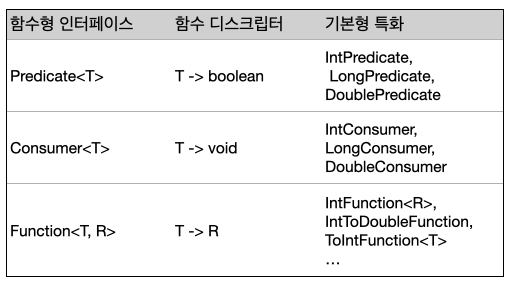
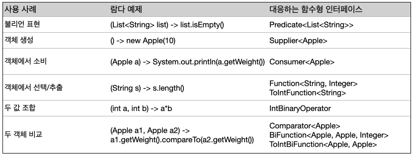

<br>

## <strong>함수형 인터페이스 사용</strong>

<br>

이번 절에서는 다양한 람다를 전달하는 데 재활용할 수 있도록 자바8에 추가된 새로운 인터페이스를 살펴본다. <br><br>
함수형 인터페이스는 오직 하나의 추상 메서드를 지정한다. <br>람다 표현식의 시그니처를 묘사한 함수형 인터페이스의 추상 메서드 시그니처를 <strong>함수 디스크립터</strong> 라고 한다. <br>
다양한 람다 표현식을 사용하려면 공통의 함수 디스크립터를 기술하는 함수형 인터페이스 집합이 필요하다. <br> 이 절에서는 Predicate, Consumer, Function 인터페이스를 설명한다.

<br><br>

### <strong>Predicate</strong>

java.util.function.Predicate<T> 인터페이스는 test 라는 추상 메서드를 정의하며 test는 제네릭 형식 T의 객체를 인수로 받아 불리언을 반환한다. 우리가 만들었던 인터페이스와 같은 형태인데 따로 정의할 필요 없이 바로 사용할 수 있다는 점이 특징이다. T 형식의 객체를 사용하는 불리언 표현식이 필요한 상황에서 Predicate 인터페이스를 사용할 수 있다. 다음 예제처럼 String 객체를 인수로 받는 람다를 정의할 수 있다. 

```java
@FunctionalInterface
public interface Predicate<T> {
    boolean test(T t);
}

public static <T> List<T> filter(List<T> list, Predicate<T> p) {
    List<T> res = new ArrayList<>();
    for (T e : list) {
        if (p.test(e)) {
            res.add(e);
        }
    }
    return res;
}

List<String> listOfStrings = new ArrayList<>();
listOfStrings.add("string");
listOfStrings.add("");
Predicate<String> nonEmptyStringPredicate = (String s) -> !s.isEmpty();
List<String> nonEmpty = filter(listOfStrings, nonEmptyStringPredicate);
```

<br>

*(참고) 제네릭 메소드* <br>
*리턴 타입 앞에 타입 파라미터를 명시하고, 리턴 타입과 인수로 타입 파라미터를 사용*

```java
public <타입 파라미터, ...> 리턴타입 메서드명(파라미터, ...) {...}
```

<br>
Predicate 인터페이스의 자바독 명세를 보면 and 나 or 같은 메서드도 있다.

<br><br>

### <strong>Consumer</strong>

java.util.function.Consumer<T> 인터페이스는 제네릭 형식 T 객체를 받아서 void 를 리턴하는 accept 라는 추상 메서드를 정의한다. <br> T 형식의 객체를 인수로 받아서 어떤 동작을 수행하고 싶을 때 Consumer 인터페이스를 사용할 수 있다. <br> 예를 들어 Integer 리스트를 인수로 받아서 각 항목에 어떤 동작을 수행하는 forEach 메서드를 정의할 때 Consumer 를 활용할 수 있다.

<br>
다음은 forEach 와 람다를 이용해서 리스트의 모든 항목을 출력하는 예제다. <br>

```java
@FunctionalInterface
public interface Consumer<T> {
    void accept(T t);
}

public <T> void forEach(List<T> list, Consumer<T> c) {
    for (T t : list) {
        c.accept(t);
    }
}

forEach(
    Arrays.asList(1, 2, 3, 4, 5), 
    System.out::println
);
```

<br><br>

### <strong>Function</strong>

java.util.function.Function<T, R> 인터페이스는 제네릭 형식 T 를 인수로 받아서 제네릭 형식 R 객체를 리턴하는 추상 메서드 apply 를 정의한다. <br> 입력을 출력으로 매핑하는 람다를 정의할 때 Function 인터페이스를 활용할 수 있다. (사과의 무게 정보를 추출하거나 문자열을 길이와 매핑) <br>
다음은 String 리스트를 인수로 받아 각 String 의 길이를 포함하는 Integer 리스트로 변환하는 map 메서드를 정의하는 예제다. <br>

```java
@FunctionalInterface
public interface Function<T, R> {
    R apply(T t);
}

public static <T, R> List<R> map(List<T> list, Function<T, R> func) {
    List<R> result = new ArrayList<>();
    for (T t : list) {
        result.add(func.apply(t));
    }
    return result;
}

// [7, 2, 6]
List<Integer> l = map(
        Arrays.asList("lambdas", "in", "action"),
        (String s) -> s.length()
);
```


<br><br>
<strong>기본형 특화</strong>

지금까지 세 개의 제네릭 함수형 인터페이스 Predicate<T>, Consumer<T>, Function<T, R> 외에 특화된 형식의 함수형 인터페이스도 있다. <br>

자바의 모든 형식은 레퍼런스형 아니면 기본형에 해당한다. 하지만 제네릭 파라미터(Consumer<T> 의 T) 에는 레퍼런스형만 사용할 수 있다. 제네릭의 내부 구현 때문에 기본형을 사용할 수 없으므로, 자바에서는 기본형을 레퍼런스형으로 변환하는 기능을 제공한다. 이를 boxing 이라고 한다. 레퍼런스형을 기본형으로 변환하는 반대 동작을 unboxing 이라고 한다. 또한 박싱과 언박싱이 자동으로 이루어지는 autoboxing 기능도 제공한다. <br>

```java
List<Integer> list = new ArrayList<>();
for (int i = 300; i < 400; ++i) {
    list.add(i);
}
```

하지만 위와 같이 int 가 Integer 로 오토박싱되는 변환 과정은 비용이 소모된다.<br>
박싱한 값은 기본형을 감싸는 래퍼 클래스고, 이는 힙에 저장된다. 따라서 래퍼 클래스는 메모리를 더 소비하고 기본형을 가져올 때도 메모리를 탐색하는 과정이 필요하다. <br><br>
자바 8 에서는 기본형을 입출력으로 사용하는 상황에서 오토박싱 동작을 피할 수 있도록 특별한 버전의 함수형 인터페이스를 제공한다. <br> 예를 들어 아래 예제에서 IntPredicate 는 1000 이라는 값을 박싱하지 않지만, Predicate<Integer> 는 1000 이라는 값을 Integer 객체로 박싱한다.

```java
@FunctionalInterface
public interface IntPredicate {
    boolean test(int t);
}

IntPredicate evenNumbers = (int i) -> i % 2 == 0;
evenNumbers.test(1000); // true, int 로 받기 때문에 박싱 없음

Predicate<Integer> oddNumbers = (Integer i) -> i % 2 != 0;
oddNumbers.test(1000); // false, 박싱
```

<br>
일반적으로 특정 형식을 입력으로 받는 함수형 인터페이스의 이름 앞에는 DoublePredicate, IntConsumer, LongBinaryOperator 처럼 형식명이 붙는다. Function 인터페이스는 ToIntFunction<T>, IntToDoubleFunction 등의 다양한 출력 형식 파라미터를 제공한다. <br>

<br>


<br><br>
함수형 인터페이스와 람다의 사용 사례, 람다 예제, 사용할 수 있는 함수형 인터페이스는 다음과 같다.

