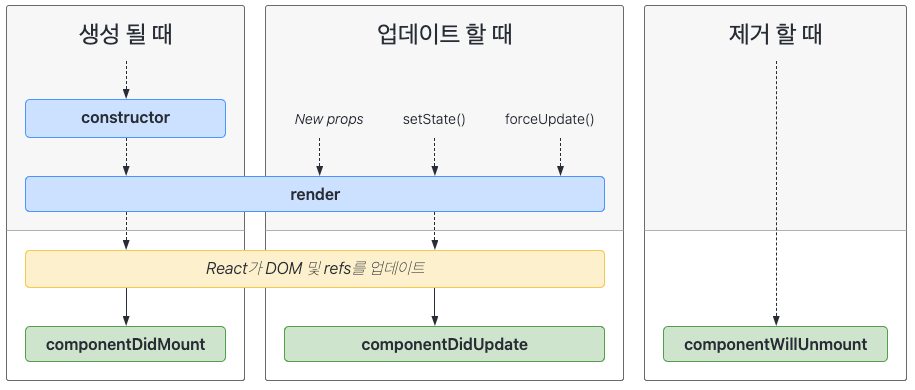

<br>

## Component ##

하나의 의미를 가진 독립적인 단위의 모듈 <br>
커스텀 HTML 태그라고 생각할 수 있다.<br>

예를 들어 화면에 "Hello, {name}" 을 띄운다면

```javascript
function Welcome(props) {
  return <h1>Hello, {props.name}</h1>
}
```

Welcome 이라는 컴포넌트를 정의하고, render 를 사용해서 렌더링한다. <br>

```javascript
const element = <Welcome name="Jason" />;
ReactDOM.render(
  element, 
  document.getElementById('root')
);
```

<br>

## Props ##

상위 컴포넌트가 하위 컴포넌트에게 내려주는 데이터 <br>
props 는 객체다.

위 예시에서 element 라는 엘리먼트를 만들 때 이미 props 를 전달해 준 것 <br>
Welcome name="Jason" 에서 {name: "Jason"} 이라는 객체, props 를 하위 Welcome 컴포넌트에 전달해줬기 때문에 화면에 Hello, Jason 이 보이게 되는 것이다.<br>

Props 컴포넌트는 읽기 전용이다. 하위 컴포넌트는 props 를 변경할 수 없다.

<br>

## State ##

컴포넌트가 독립적으로 갖는 상태 <br>
객체의 형태로 컴포넌트 안에서만 제어되어 보관, 관리된다. <br><br>

```javascript
class Clock extends React.Component {
    constructor(props) {
        super(props);
        this.state = {date: new Date()};
}
```

this.state 는 constructor 안에 지정 <br>
state 는 직접 변경할 수 없고, setState() 를 사용해야한다. <br>
setState() 가 실행될 때 마다 React 는 state 가 변경된 것을 인지하고 render() 메서드를 다시 호출한다. <br>
리액트는 render() 메서드 안의 달라진 내용에 따라 DOM 을 업데이트한다. <br><br>
컴포넌트는 자신의 state 를 자식 컴포넌트에 props 로 전달할 수 있다.

<br>


## Life Cycle ##


<br>
<br>

출처: https://medium.com/amhocode/react-%EC%9E%85%EB%AC%B8%EC%9E%90%EB%9D%BC%EB%A9%B4-%EA%BC%AD-%EC%95%8C%EC%95%84%EC%95%BC-%ED%95%A0-%EA%B8%B0%EC%B4%88-%EA%B0%9C%EB%85%90-5%EA%B0%80%EC%A7%80-component-props-state-life-cycle-lifting-state-up-95a416241ffe